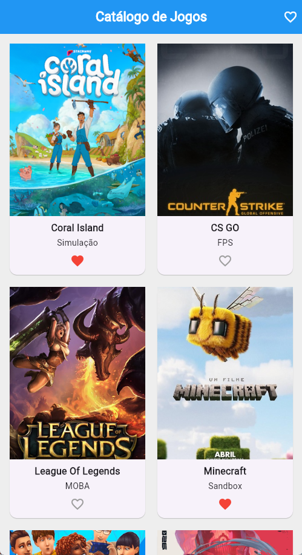

# 🎮 Catálogo de Jogos

Aplicativo desenvolvido em **Flutter** para a disciplina de **Códigos de Alta Performance - Mobile**.

O projeto consiste em um catálogo de jogos organizado em cards, utilizando a arquitetura **MVVM** e o **Provider** para gerenciamento de estado.

## 📱 Sobre o projeto

O aplicativo apresenta uma coleção de jogos em um `GridView` com duas colunas. Cada card exibe a capa do jogo, seu nome, gênero e a opção de adicioná-lo aos favoritos.

Também é possível utilizar o filtro de favoritos para visualizar apenas os jogos que foram marcados como favoritos.

## ✨ Funcionalidades

- Exibição dos jogos em um `GridView` com duas colunas
- Cards com imagem, nome e gênero
- Imagens locais utilizando `Image.asset`
- Adicionar e remover jogos dos favoritos
- Filtro para visualizar somente os jogos favoritos
- Atualização da interface utilizando `ChangeNotifier`

## 🏗️ Arquitetura

O projeto utiliza o padrão **MVVM (Model-View-ViewModel)**:

- **Model:** representa os dados de cada jogo
- **ViewModel:** gerencia a lista de jogos, os favoritos, o filtro e o estado da aplicação
- **View:** responsável pela interface e pela exibição dos dados

O **Provider** é utilizado para disponibilizar o ViewModel para a interface e atualizar a tela quando ocorre alguma alteração de estado.

## 🛠️ Tecnologias utilizadas

- Flutter
- Dart
- Provider
- Material Design

## 📂 Estrutura principal

```text
lib/
├── models/
│   └── jogo_model.dart
├── view_models/
│   └── catalogo_view_model.dart
├── views/
│   └── home_view.dart
└── main.dart

assets/
└── images/
    ├── coralisland.png
    ├── cs.jpg
    ├── lol.jpg
    ├── mine.jpg
    ├── ts4.png
    ├── valo.jpg
    └── print_catalogo.png
```

## 🎮 Jogos do catálogo

O catálogo contém os seguintes jogos:

- Coral Island
- CS GO
- League of Legends
- Minecraft
- The Sims 4
- Valorant

## 👩‍💻 Autora

**Maria Isabel Mariz**  
Matrícula: 03354801

Projeto desenvolvido como atividade avaliativa da disciplina de **Códigos de Alta Performance - Mobile**.

## 📸 Interface


